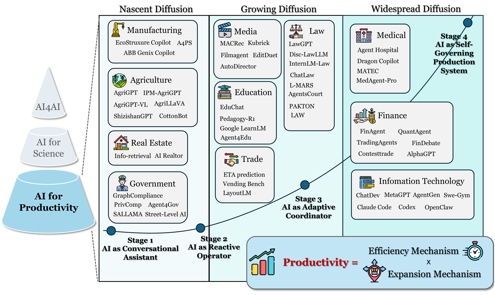

<div align="center">
  <h1>AI for Productivity Survey</h1>

  <p>
    <a href="https://arxiv.org/abs/xxxx.xxxxx">
      
    </a>
    <a href="https://huggingface.co/papers/xxxx.xxxxx">
      
    </a>
    <a href="https://github.com/zhesun-0209/AI-For-Productivity-Paper-List">
      
    </a>
    <a href="https://github.com/zhesun-0209/AI-For-Productivity-Paper-List/blob/main/LICENSE">
      
    </a>
    <a href="#citation">
      
    </a>
  </p>
</div>

---

## 📢 News
- [2026/04/] 📃 We created this repository to share updates and related literature!
- [2026/04/] 🎉 Our survey is released! See # for the paper!

---

## 📚 Table of Contents
- [🧭 Overview](#overview)
- [🪜 Stages of AI for Productivity](#stages-of-ai-for-productivity)
- [🌱 Nascent-diffusion Industries](#nascent-diffusion-industries)
  - [🏭 Manufacturing](#manufacturing)
  - [🌾 Agriculture](#agriculture)
  - [🏠 Real Estate](#real-estate)
  - [🏛️ Government and Public Administration](#government-and-public-administration)
- [📈 Growing-diffusion Industries](#growing-diffusion-industries)
  - [🛍️ Trade](#trade)
  - [📰 Media](#media)
  - [🎓 Education](#education)
  - [⚖️ Law](#law)
- [🌍 Widespread-diffusion Industries](#widespread-diffusion-industries)
  - [💻 Information Technology](#information-technology)
  - [💰 Finance](#finance)
  - [🩺 Medical](#medical)
- [📖 Citation](#citation)
- [🤝 Contribution](#contribution)
  - [🌟 Star History](#star-history)
  - [👥 Contributors](#contributors)

---

<a id="overview"></a>

# 🧭 Overview

<p align="center">
  
</p>

> **Introduction text placeholder**  
> placeholder

---

<a id="stages-of-ai-for-productivity"></a>

# 🪜 Stages of AI for Productivity

<p align="center">
  
</p>

A four-stage framework for AI-driven productivity evolution:
- **Stage 1: AI as Conversational Assistant**: Passive, single-turn informational tool, limited to preparatory assistance, fully dependent on human execution.
- **Stage 2: AI as Reactive Operator**: Automates narrow, repetitive tasks, substituting manual labor but requiring constant human oversight and error correction.
- **Stage 3: AI as Adaptive Coordinator**: Manages complex workflows, coordinates agents, and scales team-level capability, but relies on human-defined goals and requirements.
- **Stage 4: AI as Self-Governing Production System**: Autonomous ecosystem that translates abstract goals into actionable plans, orchestrates multi-agent systems, and expands the production frontier, with human oversight focused on strategic alignment and safety.

---

<a id="nascent-diffusion-industries"></a>

# 🌱 Nascent-diffusion Industries

<p align="center">
  
</p>

**Nascent-diffusion industries** represent the early stage of AI adoption where Agentic AI primarily serves as a **conversational assistant** and **reactive operator** under human supervision.

In this phase, AI penetration remains limited, with applications focused on efficiency-driven, task-specific assistance rather than end-to-end autonomous operation. The figure outlines current AI use cases and core limitations across four representative sectors:
- 🏭 **Manufacturing**: Defect detection, engineering & design assistance, operational decision support
- 🌾 **Agriculture**: Plant disease diagnosis, agricultural decision support, consultation cross-validation
- 🏠 **Real Estate**: Property price estimation, transaction information extraction, property marketing copywriting
- 🏛️ **Government & Public Administration**: Administrative business consultation, social stimulation, administrative document writing

<a id="manufacturing"></a>

## 🏭 Manufacturing

| Title | Model | Date | Venue |
| ----- | ----- | ---- | ----- |
| [TBD](#) | TBD | 2025 | TBD |
| [TBD](#) | TBD | 2025 | TBD |

<a id="agriculture"></a>

## 🌾 Agriculture

| Title | Model | Date | Venue |
| ----- | ----- | ---- | ----- |
| [AgroLLM](#) | LLM + RAG | 2025 | TBD |
| [TBD](#) | TBD | 2025 | TBD |

<a id="real-estate"></a>

## 🏠 Real Estate

| Title | Model | Date | Venue |
| ----- | ----- | ---- | ----- |
| [Utilizing Large Language Models for Information Extraction from Real Estate Transactions](#) | TBD | 2024 | TBD |
| [Real Estate Attribute Value Extraction Using Large Language Models](#) | TBD | 2024 | TBD |
| [AI Realtor: Towards Grounded Persuasive Language Generation for Automated Copywriting](#) | TBD | 2024 | TBD |
| [On the Performance of Large Language Models for Real Estate Appraisal](#) | TBD | 2024 | TBD |

<a id="government-and-public-administration"></a>

## 🏛️ Government and Public Administration

| Title | Model | Date | Venue |
| ----- | ----- | ---- | ----- |
| [Cooperate or Collapse: Emergence of Sustainable Cooperation in a Society of LLM Agents](#) | TBD | 2025 | TBD |
| [Generative Agent Simulations of 1,000 People](#) | TBD | 2023 | TBD |
| [GraphCompliance: Aligning Policy and Context Graphs for LLM-Based Regulatory Compliance](#) | TBD | 2025 | TBD |
| [PrivComp-KG: Leveraging KG and LLM for Compliance Verification](#) | TBD | 2025 | TBD |
| [LLM Based Multi-Agent Generation of Semi-structured Documents](#) | TBD | 2025 | TBD |
| [Agents4Gov: Privacy-Preserving Browser Automation for Public Sector](#) | TBD | 2025 | TBD |

---

<a id="growing-diffusion-industries"></a>

# 📈 Growing-diffusion Industries

<p align="center">
  
</p>

> **Growing-diffusion introduction placeholder**  
> placeholder

<a id="trade"></a>

## 🛍️ Trade

| Title | Model | Date | Venue |
| ----- | ----- | ---- | ----- |
| [TBD](#) | TBD | 2025 | TBD |
| [TBD](#) | TBD | 2025 | TBD |

<a id="media"></a>

## 📰 Media

| Title | Model | Date | Venue |
| ----- | ----- | ---- | ----- |
| [SANCTUARY: Evidence-based Automated Fact Checking](#) | TBD | 2025 | TBD |
| [ScoreRAG: Consistency-Relevance Scoring for News Generation](#) | TBD | 2025 | TBD |
| [Journalism-Guided Agentic In-Context Learning for News Stance Detection](#) | TBD | 2025 | TBD |
| [Toward Verifiable Misinformation Detection](#) | TBD | 2025 | TBD |
| [OpenFactCheck: Factuality Evaluation of LLMs](#) | TBD | 2024 | TBD |
| [EditDuet: Multi-Agent Video Non-Linear Editing](#) | TBD | 2025 | TBD |
| [JRE-L: Journalist, Reader, Editor LLMs for Science Journalism](#) | TBD | 2025 | TBD |
| [Can Memory-Augmented LLM Agents Aid Journalism](#) | TBD | 2025 | TBD |
| [MACRec: Multi-Agent Collaboration for Recommendation](#) | TBD | 2024 | TBD |
| [On Generative Agents in Recommendation](#) | TBD | 2024 | TBD |
| [FilmAgent: End-to-End Film Automation in Virtual 3D Spaces](#) | TBD | 2025 | TBD |
| [Kubrick: Multimodal Agent Collaborations for Synthetic Video](#) | TBD | 2025 | TBD |
| [Automated Movie Generation via Multi-Agent CoT Planning](#) | TBD | 2025 | TBD |
| [AutoDirector: Online Auto-scheduling Agents for Multi-sensory Composition](#) | TBD | 2025 | TBD |

<a id="education"></a>

## 🎓 Education

| Title | Model | Date | Venue |
| ----- | ----- | ---- | ----- |
| [TBD](#) | TBD | 2025 | TBD |
| [TBD](#) | TBD | 2025 | TBD |

<a id="law"></a>

## ⚖️ Law

| Title | Model | Date | Venue |
| ----- | ----- | ---- | ----- |
| [LawGPT: A Chinese Legal Knowledge-Enhanced Large Language Model](https://doi.org/10.48550/arXiv.2406.04614) | LawGPT | 06/2024 | arXiv |
| [Lawyer LLaMA Technical Report](https://doi.org/10.48550/arXiv.2305.15062) | Lawyer&nbsp;LLaMA | 05/2023 | arXiv |
| [InternLM-Law: An Open-Sourced Chinese Legal Large Language Model](https://aclanthology.org/2025.coling-main.629/) | InternLM‑Law | 01/2025 | COLING 2025 |
| [DISC-LawLLM: Fine-tuning Large Language Models for Intelligent Legal Services](https://arxiv.org/abs/2309.11325) | Disc‑LawLLM | 09/2023 | arXiv |
| [SaulLM-7B: A Pioneering Large Language Model for Law](https://arxiv.org/abs/2403.03883) | SaulLM | 03/2024 | arXiv |
| [ChatLaw: A Multi-Agent Collaborative Legal Assistant with Knowledge Graph Enhanced Mixture-of-Experts Large Language Model](https://arxiv.org/abs/2306.16092) | ChatLaw | 06/2023 | arXiv |
| [L-MARS: Legal Multi-Agent Workflow with Orchestrated Reasoning and Agentic Search](https://arxiv.org/abs/2509.00761) | L‑MARS | 08/2025 | arXiv |
| [PAKTON: A Multi-Agent Framework for Question Answering in Long Legal Agreements](https://aclanthology.org/2025.emnlp-main.403/) | PAKTON | 11/2025 | EMNLP 2025 |
| [AgentsCourt: Building Judicial Decision-Making Agents with Court Debate Simulation and Legal Knowledge Augmentation](https://aclanthology.org/2024.findings-emnlp.549/) | AgentCourt | 11/2024 | Findings of EMNLP 2024 |
| [LAW: Legal Agentic Workflows for Custody and Fund Services Contracts](https://aclanthology.org/2025.coling-industry.50/) | LAW | 01/2025 | COLING 2025 Industry Track |
| [Law in Silico: Simulating Legal Society with LLM-Based Agents](https://arxiv.org/abs/2510.24442) | Law in Silico | 10/2025 | arXiv |

---

<a id="widespread-diffusion-industries"></a>

# 🌍 Widespread-diffusion Industries

<p align="center">
  
</p>

> **Widespread-diffusion introduction placeholder**  
> placeholder

<a id="information-technology"></a>

## 💻 Information Technology

| Title | Model | Date | Venue |
| ----- | ----- | ---- | ----- |
| [DeepSeek-Coder-V2](#) | TBD | 2024 | TBD |
| [WizardCoder: Evol-Instruct for Code LLMs](#) | TBD | 2023 | TBD |
| [CodeRL: Pretraining + RL for Code Generation](#) | TBD | 2022 | TBD |
| [PPOCoder: Execution-based Code Generation](#) | TBD | 2024 | TBD |
| [StepCoder: RL from Compiler Feedback](#) | TBD | 2024 | TBD |
| [CodeRL+: Execution Semantics Alignment](#) | TBD | 2025 | TBD |
| [Process-Supervised RL for Code Generation](#) | TBD | 2025 | TBD |
| [Teaching LLMs to Self-Debug](#) | TBD | 2024 | TBD |
| [Revisit Self-Debugging with Self-Generated Tests](#) | TBD | 2025 | TBD |
| [PyCapsule: LLM Guided Self-Debugging](#) | TBD | 2025 | TBD |
| [ChatDev: Communicative Agents for Software Development](#) | TBD | 2024 | TBD |
| [MetaGPT: Multi-Agent Collaborative Programming](#) | TBD | 2024 | TBD |
| [MapCoder: Multi-Agent Code for Competitive Problems](#) | TBD | 2024 | TBD |
| [MapCoder-Lite: Multi-Agent in Small LLM](#) | TBD | 2025 | TBD |
| [CodePlan: Repository-level Coding and Planning](#) | TBD | 2025 | TBD |
| [SWE-Gym: Training Software Engineering Agents](#) | TBD | 2025 | TBD |
| [AgentGen: Enhancing Planning for LLM Agents](#) | TBD | 2025 | TBD |
| [R2E-Gym: Procedural Environments for SWE Agents](#) | TBD | 2025 | TBD |
| [DeepSWE: RL Scaling for Coding Agents](#) | TBD | 2025 | TBD |
| [RepoForge: End-to-End Data for SWE Agent Training](#) | TBD | 2025 | TBD |

<a id="finance"></a>

## 💰 Finance

| Title | Model | Date | Venue |
| ----- | ----- | ---- | ----- |
| [TBD](#) | TBD | 2025 | TBD |
| [TBD](#) | TBD | 2025 | TBD |

<a id="medical"></a>

## 🩺 Medical

| Title | Model | Date | Venue |
| ----- | ----- | ---- | ----- |
| [TBD](#) | TBD | 2025 | TBD |
| [TBD](#) | TBD | 2025 | TBD |

---

<a id="citation"></a>

## 📖 Citation

If you find this repository useful, please cite our survey:

```bibtex
@article{your_survey,
  title={AI for Productivity Survey},
  author={},
  journal={},
  year={2026}
}
```

## 🤝 Contribution
Contributions are welcome!

If you would like to improve this repository, you are welcome to:
- add missing papers,
- revise incorrect metadata,
- update paper links and venue information.

Please feel free to open an issue or submit a pull request!

### 🌟 Star History

[](https://www.star-history.com/#zhesun-0209/AI-For-Productivity-Paper-List&Date)

### 👥 Contributors

<a href="https://github.com/zhesun-0209/AI-For-Productivity-Paper-List/graphs/contributors">
  
</a>
